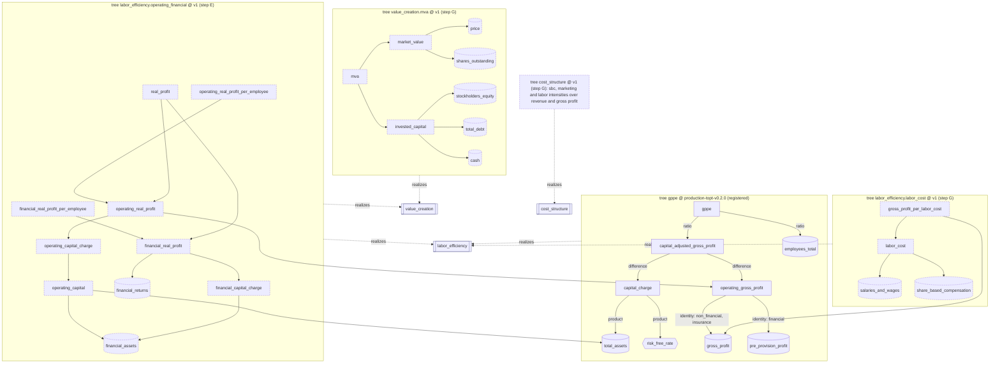

# Metric forest

Design for #528, following the owner decision of 2026-09-17. Status: proposed. Nothing in
this document is merged yet. Step B (the registry, with GPPE v0.2.0 as its first tree) is
proposed in #909 (§11), which adds `libs/factors/src/factors/forest/`. Where a section says what
step B does, it describes #909, not `main`. `init.md` stays the authority. This document describes how rule 17 and §7 module 2 are
implemented without a hardcoded formula.

## 0. The decisions this implements

| date | decision (owner, #528 unless noted) |
|---|---|
| 2026-07-17 | #59 item 2: formula variants are configuration, not pipeline changes. Labor efficiency starts as gross profit / headcount; later variants divide by labor cost (salaries + ESOP), "and there may be many more". |
| 2026-07-17 | #59 item 5: separate operating profit from investment profit, for every issuer. Real investment profit = investment returns − risk-free return on the same assets. |
| 2026-09-04 | Every issuer is operating + financial. Compute both and merge them into one wide row. The per-component sign policy replaces the `gppe-not-negative` exemption. |
| 2026-09-16 | The exemption was extended once, to 2026-09-23 (#886). It must not be extended again without the owner. |
| 2026-09-17 | Keep diversity. The metrics form a forest: gross profit, Market Value Added, stock-based compensation, labor cost, marketing cost, and so on, possibly with several ways to decompose each. **The engineering structure must not hardcode GPPE.** |
| 2026-09-17 | #877: entities are identified by UUIDs with typed aliases. |

## 1. What exists, measured in code (`main@f5807a7`)

- **GPPE is written out by hand twice.**
  - `factors.production_topt.core.compute_topt_gppe` (L664-672) branches on
    `operating_branch` to pick the numerator (pre-provision profit for banks, gross profit
    otherwise). It then subtracts `total_assets × risk_free_rate` for every class and
    divides by headcount.
  - `factors.base.gross_profit_per_employee` repeats the formula, together with a Qlib
    expression of it.
  - The docstring of the base factor says a negative value is "a valid low signal".
- **The metric registry and the standards each answer one question.**
  - `truealpha_contracts.metrics.METRICS` says which source wins a field.
  - `truealpha_contracts.standards.STANDARDS` (#733) says what a field means and how the
    loop fills it.
  - Nothing says how metrics compose, so every new formula is new code.
- **The two sign checks contradict the definition.**
  - `tools/output_invariants.py` has `gppe-not-negative`, which claims that no negative GPPE
    can be true.
  - `plausibility_policy.sign_per_branch` claims a financial or insurance operating metric
    cannot be negative.
  - Both held only under an exemption that expires on 2026-09-23. Without it, JPM's tick is
    refused and the TOPT head freezes.
- **The wide row is fixed columns.**
  - `mart.topt_gppe_results` and `mart.topt_core_results` carry `gppe`,
    `operating_efficiency` and `capital_adjusted_gross_profit`.
  - `mart.strategy_decisions` carries `capital_adjusted_labor_efficiency`.
  - `staging.strategy_backtest_inputs` is long (`input_key`) and is validated against
    `METRICS`.
  - Each new factor column so far has needed a migration (PEG: 0039, 0040).
- **The confidence report grades inputs, not factors.**
  - `data_engine.datahub.confidence_report.FAMILIES` bands each financial field
    `high/medium/low/missing`. The fields are revenue, gross_profit, pre_provision_profit,
    total_assets, shares_outstanding, net_income and headcount.
  - Factor outputs have no band.
- **There are no UUIDs and no embedding store.**
  - Ids are content addresses (`kind:sha256`) or semantic keys (`issuer:cik:…`).
  - `staging.kg_entities`, `kg_identifiers` and `kg_edges` exist.
  - No pgvector table exists.

## 2. The model

The model has four kinds of thing. Each is declarative and checked in code (rule 22: a
registry edit, not a migration).

### 2.1 Node

A node is one metric with one meaning.

| field | meaning |
|---|---|
| `node_id` | UUID, minted once and never recomputed (§5) |
| `key` | readable name; itself an alias |
| `kind` | `input` (captured, fused by `METRICS`), `parameter` (a versioned definition parameter such as the risk-free rate), `derived` (computed by exactly one decomposition) or `concept` (a question with no value, which trees realize) |
| `definition` | what the value is, in one sentence |
| `unit` | `truealpha_contracts.metrics.UnitFamily` (currency, count, per_employee, ratio, …) |
| `period` | `fiscal-year-flow`, `fiscal-year-end-stock`, `cutoff-instant` or `definitional` |
| `applicability` | the issuer classes the node exists for (`non_financial`, `financial`, `insurance`, the values `operating_branch` already carries) |
| `sign_policy` | per applicable class: `may-be-negative`, `must-be-non-negative` or `sign-is-signal` (§6) |
| `provenance` | `metric-registry:<METRICS name>` with an optional specialisation note (e.g. the financial-issuer split of `gross_profit`), `definition-parameter:<name>`, or `derived:<tree>`. Never a vendor (rule 3). |
| `confidence` | `as-captured` with the confidence-report family that bands the input, `minimum-consumed` for a derived node, or `definitional` for a parameter (§8) |
| `aliases` | typed: `metric`, `input_key`, `topt_snapshot_field`, `definition_parameter`, and later `mart_column`, `xbrl_concept` or `kg_identifier` |

### 2.2 Decomposition (edge)

A decomposition is a typed hyperedge: `output = formula(operands)`. It carries a `formula_id`
and a `formula_version`. Registered formulas are `identity`, `sum`, `difference`, `product`
and `ratio`, each at v1, and a version is immutable.

**Operands are bound per issuer class.** That one mechanism replaces both kinds of branch
that were in code:

- a class-specific **proxy**: `operating_gross_profit ← identity(gross_profit)` for
  non-financial and insurance issuers, and `identity(pre_provision_profit)` for banks;
- a class-specific **charge**: `capital_charge ← product(total_assets, risk_free_rate)`
  today, identical for every class. A different base or rate for one class is a different
  binding in a new tree version, never an `if` in a factor.

A ratio whose denominator is zero is *undefined*, with a reason, never a number. A missing
input makes every node above it undefined, with a reason.

### 2.3 Tree

A tree is a registered, versioned set of decompositions under one `root`. It also declares:

- `realizes`: the concept the tree answers;
- `applicability`: the issuer classes it covers;
- its decimal context (precision and half-even rounding).

The tree's identity is `sha256` over the tree, every node it reaches and the concept. A
change to what a tree computes, or to a reached node's unit, sign policy, aliases or
applicability, changes that identity. Under an unchanged version this is a **silent formula
edit**, and a frozen-identity test fails on it (#528 acceptance: a definition change must bump
the version, and the prior one must stay resolvable).

### 2.4 Forest

The forest is every node and every tree. It is validated once, at import:

- UUIDs are unique across nodes and trees, and `(tree key, version)` identifies one tree.
- **A derived node has exactly one decomposition across the whole forest.** Its value
  therefore never depends on which tree reached it, which is what makes one wide-row column
  per node well defined. A different formula is a different node, with a new key and a new
  UUID.
- A tree is acyclic, and every decomposition in it is reachable from its root.
- Every decomposition binds operands for every class of its tree, and every operand applies
  to the class it is bound for. A bank cannot be bound to `gross_profit`.
- Only derived nodes are decomposition outputs, and only concepts are realized.

**Several trees may realize the same concept.** Examples: labor efficiency by
capital-adjusted gross profit, by operating real profit, or by labor cost; value creation by
the gross-profit path or by the MVA path. They share leaves such as `total_assets` and
`employees_total`, and they all land on the same wide row. That is the "keep diversity" in
the owner's decision.

## 3. The initial forest

The forest below is the target, not the first PR. Solid boxes are registered in step B;
dashed boxes are the trees of steps E and G (§11).

### 3.1 Trees

| tree | realizes | root = … | sign policy of the root | step |
|---|---|---|---|---|
| `gppe @ production-topt-v0.2.0` | labor_efficiency | (operating gross profit − total_assets × rf) / employees | `sign-is-signal`, every class (#59's reading) | **B (implemented)** |
| `labor_efficiency.operating_financial @ v1` | labor_efficiency, value_creation | operating real profit / employees and financial real profit / employees. `real_profit` = sum of the two. | both `sign-is-signal`: "some managers beat Treasuries, some do not" (#59 item 5) | E |
| `value_creation.mva @ v1` | value_creation | market value − invested capital | `sign-is-signal` (value destroyed is a signal) | G |
| `labor_efficiency.labor_cost @ v1` | labor_efficiency | gross profit / (salaries + SBC) (#59 item 2) | `sign-is-signal` | G |
| `cost_structure @ v1` | cost_structure | SBC / gross profit, marketing / revenue, labor / revenue | `must-be-non-negative` (a negative expense is a mapping defect) | G |

The decomposition tree (step E) follows the 2026-09-08 proposal on #528:

- `operating_capital = total_assets − financial_assets` is `must-be-non-negative`. A negative
  value means the financial-asset basis double counted, so it is a defect, not a signal.
- `operating_real_profit = operating_gross_profit − operating_capital × rf`.
- `financial_real_profit = financial_returns − financial_assets × rf`.
- Every leaf records its resolution basis on the row, for example
  `vintage.financial_assets.basis`.
- A bank's `operating_capital` binding is an owner decision (§12 D2). In the forest it is a
  per-class operand binding and nothing else.

### 3.2 Coverage of the new inputs (9 packaged `apps/data-engine/samples/sec` bodies, FY2024+ annual)

The production counts over 111 bodies for `financial_assets` and `financial_returns` are on
#528 (2026-09-08). The step-G inputs were counted on the packaged samples only:

| concept | issuers (of 9) |
|---|---|
| `ShareBasedCompensation` | 8 |
| `AllocatedShareBasedCompensationExpense` | 7 |
| `SellingAndMarketingExpense` | 5 |
| `AdvertisingExpense` | 4 |
| `SellingGeneralAndAdministrativeExpense` | 3 |
| `LaborAndRelatedExpense` | 2 (JPM, META) |
| `SalariesAndWages` | 0 |
| `StockholdersEquity` | 8 |
| `LongTermDebtNoncurrent` / `LongTermDebt` | 4 / 3 |
| `CashAndCashEquivalentsAtCarryingValue` | 8 |

SBC is broadly tagged. Labor cost is not: `LaborAndRelatedExpense` is tagged by 2 of 9, so
the labor-cost tree needs the #735 loop (filing extraction) for its denominator. That is the
same situation headcount was in.

## 4. GPPE v0.2.0 as a tree, with zero numeric change (step B)

| `core.py` on main | forest |
|---|---|
| `if operating_branch is FINANCIAL: numerator = pre_provision_profit else gross_profit` | `operating_gross_profit ← identity`, operands bound per class |
| `total_assets.value * risk_free_rate` | `capital_charge ← product(total_assets, risk_free_rate)`, the same binding for every class |
| `numerator − charge` | `capital_adjusted_gross_profit ← difference(operating_gross_profit, capital_charge)` |
| `capital_adjusted / headcount` | `gppe ← ratio(capital_adjusted_gross_profit, employees_total)` |
| `localcontext(prec=34, ROUND_HALF_EVEN)` | `tree.decimal_precision = 34`, `rounding = ROUND_HALF_EVEN` |
| the required inputs per branch, and their `missing_*` reasons | `required_inputs(tree, class)`: each input names its `topt_snapshot_field` alias, and the reason is `missing_<field>` |

In #909, `compute_topt_gppe` evaluates the tree. Three tests, added by #909 in
`libs/factors/tests/forest/test_gppe_tree.py`, show that nothing moves:

1. The tree equals the former kernel, kept verbatim in the test. The comparison uses the
   value and the string representation (exponent included), over a grid that crosses each
   class with negative, zero, non-terminating and large values, plus 200 seeded random
   cases.
2. **`ToptGppeResult.result_id` is reproduced** for nine cases whose identities were captured
   from `main@f5807a7` before the kernel was replaced.
   - The cases cover JPM at the production rate (0.05) and at the corpus rate (0.038), an
     insurer, an NVDA-shaped issuer, a negative non-financial issuer, a non-terminating
     division, a bank with gross profit but no PPNR, missing inputs, and a non-positive
     headcount.
   - A result id hashes every published field, so an equal id means byte-identical
     `mart.topt_gppe_results` rows. `GppeV0Definition`, and therefore every
     `gppe_definition_id`, is unchanged.
3. The tree's identity is frozen under `production-topt-v0.2.0`, and the tree's version is
   bound to `GppeV0Definition.factor_version`.

#909 also adds a `tools/mutations.json` entry, `forest/gppe-tree-reproduces-v020`. It re-proves
check 2 weekly by binding a bank's numerator to `total_assets`.

Out of scope for step B: `factors.base.gross_profit_per_employee` evaluates in the ambient
decimal context (precision 28), not 34. Moving it onto the tree is a numeric change for the
strategy path, so it is its own versioned step (H).

## 5. Identity: UUIDs and typed aliases (#877)

- Node and tree UUIDs are `uuid5(NS, "<kind>:<key>[:<version>]")` with
  `NS = uuid5(NAMESPACE_URL, "https://github.com/wangzitian0/truealpha/metric-forest")`.
  They are **minted once and stored as literals**. A test pins them, so renaming a key keeps
  its UUID.
- A new node gets a new UUID. So does a derived node whose formula changes, because a
  different formula is a different node.
- Every other name is an alias of a declared kind: `metric`, `input_key`,
  `topt_snapshot_field` and `definition_parameter` today, and `mart_column`, `xbrl_concept`
  and `kg_identifier` later. `input_key` is how `INPUT_KEY_ALIASES` (`headcount`,
  `last_close`) migrates into the forest, and `topt_snapshot_field` is how `compute_topt_gppe`
  finds a value without naming it.
- Rows that hold node values key on the UUID, never on the key (§7).

## 6. Sign policy: replacing `gppe-not-negative` and `sign-per-branch`

| policy | a negative value is | nightly suite (`node-sign-policy`) | tick gate (policy v2) |
|---|---|---|---|
| `must-be-non-negative` | a defect | fails | refuses the tick |
| `sign-is-signal` | a valid, ranked low signal | holds, and prints `SIGNAL <listing> <branch> <column> <node> <value>` | accepts, and `Verdict.signals` prints it |
| `may-be-negative` | arithmetic, meaning nothing by itself | holds silently | accepts |
| no policy for the row's class | any value is unvouched | fails | refuses |

In #909, both checks are generated from the forest. `factors.forest.PUBLISHED_COLUMNS` ties each
published mart column to its node, and there is no second list of what a negative number
means. The suite also asserts two things the tree implies:

- **Sign propagation:** for `gppe ← ratio(capital_adjusted_gross_profit, employees_total)`
  with a non-negative denominator, the two published signs agree. A published output whose
  numerator is NULL also fails.
- **One node, one value:** `operating_efficiency` and `gppe` carry the same node, so they
  must be equal (`is distinct from`, so a NULL on one side fails too).

Under v0.2.0 the nodes declare #59's reading: `gppe` and `capital_adjusted_gross_profit` are
`sign-is-signal` for every class. JPM's −514,726 is therefore neither refused nor exempted:
it is printed by name on every tick and every nightly run. #909 therefore removes the #528
entry from `tools/output_invariant_exemptions.json`, which today still defers
`gppe-not-negative` until 2026-09-23.

Red-proofs that #909 adds, all against a real materialized governed head
(`apps/data-engine/tests/production_topt/test_node_sign_invariant.py`):

- the same JPM row fails under a forest whose GPPE node forbids a negative financial value;
- a sign flip between `gppe` and `capital_adjusted_gross_profit` fails, and so does a published
  `gppe` whose numerator is NULL;
- `operating_efficiency` ≠ `gppe` fails, including a NULL beside a value. The 0030 values
  check is NOT VALID, so grandfathered rows can carry that shape.

When step E lands, each component carries its own policy. `node-sign-policy` asserts it with
no code change, because the columns are added to `PUBLISHED_COLUMNS` (and later generated,
§7).

## 7. The wide row, generated from the registry

**Cell identity.** A cell is `(run, issuer, node_id, period)`.

- `period` is relative to the cutoff: `FY0` is the latest fiscal year knowable at the cutoff,
  then `FY-1`, and so on. The absolute tag (`truealpha_contracts.fiscal_period.encode_annual`)
  is stored in the cell.
- A node declares which relative periods it publishes. The default is `FY0`, and PEG's net
  income series needs `FY0..FY-3`.
- `cutoff-instant` nodes have the single period `cutoff`.

**Storage (step D, one migration, once).** The storage is `mart.metric_node_values`,
append-only. Each row carries:

- `run_id`, `issuer_id`, `node_id` (uuid) and `period`;
- `period_tag`, `value numeric` and `unit`;
- `availability_status`, `reason_codes` (the evaluator's `undefined` reasons: `missing_input`,
  `undefined_operand`, `zero_denominator`);
- `source_evidence_status`, `factor_validation_status` (#747);
- `confidence` and `confidence_band`;
- `tree_id`, `tree_version` and `tree_sha256` for derived cells;
- `input_observation_ids`.

Adding a node adds rows, never columns. That is #284's axis and rule 22 ("a registry edit,
never a migration"), and it is proven by a test that registers a synthetic node and finds no
migration in the diff.

**The wide row is a pivot the registry generates.** `FOREST.columns()` returns
`(node, period) → column label` (`gppe@FY0`, `operating_real_profit@FY0`, `mva@cutoff`). The
typed App/MCP reader and the strategy input projection both read the pivot.

The existing fixed columns stay as a compatibility projection:

- `mart.topt_gppe_results`, `mart.topt_core_results` and
  `mart.strategy_decisions.capital_adjusted_labor_efficiency` remain;
- `PUBLISHED_COLUMNS` ties each of them to its node, so the invariants judge them now;
- step D generates `PUBLISHED_COLUMNS` instead of declaring it.

**Strategy inputs.**

- `staging.strategy_backtest_inputs.input_key` accepts a node's `input_key` alias, so
  `is_registered_input_key` consults the forest.
- `strategy_bridge._STRATEGY_FINANCIAL_KEYS` becomes the forest's input nodes, which removes
  the rule-22 violation that init.md names.
- `mart.strategy_input_coverage` measures, per issuer, `required_inputs(tree, class)` of the
  trees the strategy consumes. A bank is then required to carry `pre_provision_profit`, not
  `gross_profit`. Today `LargeModelValueV0Definition.required_input_keys()` does not depend
  on the issuer class.

## 8. Confidence bands

- **Input nodes** name the confidence-report family that bands them: `gross_profit`,
  `pre_provision_profit`, `total_assets` and `headcount` already exist in
  `confidence_report.FAMILIES`. A new input node needs a family, and the family gets its
  reconciliation policy the way #854 added them. Step D adds a test that every forest
  input's family exists.
- **Derived nodes** take `minimum-consumed`:
  - the value confidence is the minimum consumed (init.md §7);
  - the band is the worst band consumed, in the order `missing < low < medium < high`;
  - parameters are excluded, because they are declared, not measured.
- **Step I** adds the report's node section: a band per `(issuer, node, period)` read from
  `mart.metric_node_values`. The App renders it beside the three status dimensions.

## 9. Graph and embedding stores

- **KG projection (step I)**, generated from the forest at deploy, idempotent and keyed by
  the forest's content hash:
  - `staging.kg_entities` holds `metric_node` and `metric_tree` rows keyed by UUID;
  - `staging.kg_identifiers` holds the typed aliases, the same shape #877 uses for issuers;
  - `staging.kg_edges` holds `decomposes_into` (output → operand, with formula id, version,
    issuer class, tree id and ordinal), `realizes` (tree → concept) and `member_of`
    (node → tree).
  - Edges are append-only vintages, like every KG edge (rule 1).
- **Embeddings:** no store exists. When one lands, it embeds a node's `definition` keyed by
  `(node_id, forest sha)`, never by key. Retrieval then answers "which metrics measure
  labor leverage?" with node UUIDs that dereference to wide-row cells.

## 10. Versioning and replay

- A tree version is immutable. A new definition is a new tree version with new derived
  nodes. The old version stays registered, so a prior run replays byte-identically (#544's
  determinism check).
- The production definition id (`gppe-definition:<sha>`) gains the tree sha when the next
  definition ships (step E). Step B does not add it, because that would change every result
  id.
- Formula versions are immutable too: a different arithmetic is a new version.

## 11. Step plan

Each step is one PR with its own acceptance check (AGENTS.md rule 7).

| step | scope | acceptance (standing) |
|---|---|---|
| **A** | This document | review |
| **B** | Proposed in #909: `factors.forest` types and evaluator; GPPE v0.2.0 registered, and `compute_topt_gppe` switched to evaluate it; `node-sign-policy` in the suite and in plausibility policy v2; the `gppe-not-negative` exemption removed; 2 mutation entries | golden result ids and frozen tree identity (`test_gppe_tree.py`); DB red-proofs (`test_node_sign_invariant.py`); `mutations.json` |
| C | Inputs of the decomposition: `financial_assets` and `financial_returns` (with basis) as `METRICS` entries and `MetricStandard`s. The SEC adapter captures them with vintage and basis. Confidence families. No factor change. | a planner and adapter test on fixtures, and a coverage row per standard (#733) |
| D | `mart.metric_node_values` (one migration) and its writer from `evaluate()` for every registered tree; the three status dimensions per cell; the pivot reader and `FOREST.columns()`; `PUBLISHED_COLUMNS` generated; input keys and coverage from the forest | a synthetic node adds no migration (`check_factor_contract.py`); the pivot equals the fixed columns on the governed head |
| E | Tree `labor_efficiency.operating_financial @ v1`: the operating and financial components for every issuer, with class bindings reviewed under #71 and a new `gppe-definition` id carrying the tree sha; golden decisions re-baselined once | #528 criteria (1)–(4): four issuer classes; both components on the row; a pre-change cutoff replays byte-identically under v0.2.0; per-component sign policy red-proven |
| F | Module 7 reads the operating component (M1 A5); versioned strategy policy | tier test per class; replay |
| G | Trees `value_creation.mva`, `labor_efficiency.labor_cost` and `cost_structure`, with their input standards (SBC, labor, marketing, equity, debt, cash) through the #735 loop | coverage probe per standard; each tree's golden cases |
| H | `factors.base.gross_profit_per_employee` and its Qlib expression generated from the tree (the precision decision) | the Qlib cross-check against the tree; strategy golden re-baselined if the precision changes |
| I | KG projection, the confidence report's node section, and App rendering | projection idempotent under an unchanged forest sha; `dashboard-read.test.ts` |

**What must happen before 2026-09-23 for the exemption:**

1. Step B is reviewed and merged.
2. The owner confirms D1 below.
3. A data-engine release containing B reaches staging and production by 2026-09-23 UTC. The
   image carries `tools/output_invariant_exemptions.json` and the gate code. The exemption is
   valid through 2026-09-23 and lapses on 2026-09-24.

Step B needs no migration.

## 12. Open owner decisions

| id | decision | needed by |
|---|---|---|
| D1 | GPPE v0.2.0's sign policy is `sign-is-signal` for every class (#59's frozen reading), declared and printed rather than exempted. The alternative, `must-be-non-negative` for banks, refuses every TOPT tick until step E ships. | step B, before 2026-09-23 |
| D2 | A bank's `operating_capital` binding in step E: total assets − securities portfolio; equity-based; or no operating charge for banks at all | step E |
| D3 | Invested capital for MVA: equity + debt − cash, or total assets − non-interest-bearing current liabilities; and whether market value is taken at the cutoff or at fiscal year end | step G |
| D4 | Labor cost composition (#59 item 2: salaries + SBC). Which concepts to use, and whether the loop extracts salaries where `LaborAndRelatedExpense` is absent (2/9 samples) | step G |
| D5 | The tier bands for the operating component per employee (recalibrate, or keep v0.2.0's) | step F |
| D6 | The node-UUID scheme (uuid5 under the namespace in §5, minted once) matches #877's entity scheme | step B (can be revisited before step I) |
