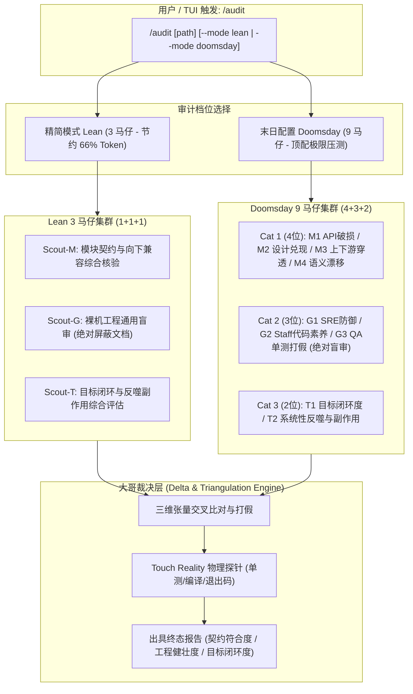

# 🛡️ /audit — 三维立体对抗代码审计协议

本 Skill 为多智能体环境提供具备**立体正交视角**的终极代码审计流水线，内置 **Touch Reality 物理探针**作为审计前的强制真源校验。

> **核心军规：自测不防自证 — "A test cannot catch its author's premise."**
> 单元测试、CI 全绿、代码断言以及 Issue Tracker，都是同一个系统自己写给自己的主观声明。
> 测试全绿与线上真实数据/行为是否正确没有任何因果关系。

## Phase 0.0: 审计对象交付状态标注 (Delivery State Annotation)

在启动任何审计流程之前，先判定审计对象的交付状态并标注：

```bash
git status -s                          # 有无未提交改动
gh pr list --head "$(git branch --show-current)" --json number,state  # 有无 PR
gh pr checks <N>                       # CI 状态
```

| 观测结果 | 标注 | 允许的评级措辞 |
|---|---|---|
| 有 PR 且 CI 已跑 | `(PR #N, CI green)` | 可使用 "Final" / "Done" |
| 已 commit 但无 PR | `(committed, no PR)` | 严禁 "Final"，可使用 "Local Verified" |
| 有未提交改动 | `(uncommitted working tree)` | 严禁 "Final" / "Done" / "Delivered" |

**评级标题必须包含上述标注**。这是工作流生命周期判定原则的执行层（见 AGENTS.md）。

---

## Phase 0: Touch Reality 物理探针（审计前强制执行）

在启动马仔集群之前，**必须**先触碰外部物理事实，获得审计基线：

### 0.1 触碰至少两路独立真源 (Independent Oracles)
严禁仅在本地 seeded 数据库或 mock 环境中自嗨：
- **Oracle A: 上游/供应商原始 API** — 不仅检查数值，还要检查三要素：数值对齐、绝对时效 (Vintage)、概念频次（$n=2$ 说明上游数据被丢弃）
- **Oracle B: 真实生产运行时** — 数据库实查（`docker exec` / SQL）、对象存储字节验证（dereference + sha256）、调度状态（读 FAILURE event log）、**双环境比对**（Staging ≠ Production）

### 0.2 扫描三大经典失效形态 (Three Failure Shapes)
这三种失效可穿透所有 Lint、Pytest、Contract 和 CI 门禁：
1. **WRONG FORMULA** — 统一公式假设破坏特例结构（如银行人均利润变负数）
2. **GREEN-WHILE-EMPTY** — 过滤逻辑过严，0 条产出但标记 SUCCESS
3. **STALE-REPORTED-AS-FRESH** — 10 年前的数据被标为 `freshness = 'fresh'`

### 0.3 肉眼常识审视 (Common Sense Audit)
> "Implausible output is evidence."
- 银行人均毛利润能是负数吗？市值偏离 4 倍？数值全是可疑的规整默认值？
- 只要输出不可信，先解释它，再提其他方案。

### 0.4 决策路径覆盖盘点 (Decision-Path Coverage)
列出输出结果依赖的全部输入要素，逐项标明验证状态、样本量、数据时效。

### 0.5 诚实披露 (Sufficiency & MECE)
- **Sufficient?** 未验证的输入一旦出错会推翻结论吗？
- **MECE?** 任务划分有重叠吗？有无主孤儿？
- **若答案让人不安，该不安本身就是最重要的 Finding。**

---

## 🚦 三道闸门（不可跳过）

这三条来自一次真实审计的实测,不是理论:15 条马仔发现中 8 条经物理打假被证伪,
其中 **6 条的根因是 scout 看不到代码**——不是模型能力不足。

### 闸门 1:审代码的必须能读代码

派 scout 做**审计或深度判断**时,**必须**使用有工具权限的载体(原生 Agent,只读),
**严禁**使用无工具权限的 `subagent_batch`——后者只能基于喂进去的片段推测,
必然产出大量待打假的臆断。`subagent_batch` 只用于不需要读仓库的广度检索。

给弱模型工具权限,比给它换强模型更有效。

### 闸门 2:每个新测试必须反向验证

修复配套的测试,**必须先在未修复的代码上跑一遍并确认变红**,才算数。
只在修复后跑绿的测试无法区分「真修复」和「断言本身是假的」。
实测中这道闸门抓出过一条大哥自己写的假断言(`assertIn(role, text)` 被散文句满足)。

### 闸门 3:修复代码必须独立复审

**安全类修复的复审要明确要求「找同一入口的第二条链」**：第一版修复几乎都只堵标题里那个洞，
洞挪一跳（实测 2026-09-22：去 `eval` 后原值被送进既有的 `python -c` 字符串拼接；正则护栏补了子命令却漏了
`git -C <dir>` 前缀）。复审 prompt 里写明：同一个不可信输入，从入口到每一个 sink 再走一遍。

**大哥不写实现代码**。修复由小弟产出后,必须再过一轮审计,
且该轮**输入只喂新写的代码,不喂原始缺陷上下文**——否则 scout 会顺着
「这是修复」的预设去确认,而不是证伪。

实测:某次审计第 3 轮在大哥自己写的修复代码里找到 3 个 HIGH,
其中一条以另一种方式重新破坏了上一轮刚修好的契约。而那轮复审之所以发生纯属偶然。

### 收敛判据

轮次不设固定上限,**某一轮「零 HIGH 且零新增 middle」才算收敛**。
只要还在改代码就不会收敛,所以**最后必须有一轮只审不改**——
否则总有一批代码没被任何人审过就合流了。

### 规模

单批次 scout **3–5 个**（lean 默认；产出的是待打假的主张，协调成本是乘法不是加法）。
协调成本是乘法不是加法:scout 翻倍 = 待打假的假说翻倍 = 大哥负担翻倍。
Doomsday 9 档仅用于发布封板,需显式 `--mode doomsday`。

---

## 核心架构：三维正交坐标系与分档策略

代码审计不能仅停留在“文档 vs 代码”的平面二分，必须构建**向上看、向下看、向内看**的三维全景防御，并按场景分档以**适度节省 Token**：

| 模式 | 马仔规模 | 适用场景 | Token 消耗 | 耗时 | 考察深度 |
| :--- | :---: | :--- | :---: | :---: | :--- |
| **Lean 精简模式（默认）** | **1 + 1 + 1 = 3 位** | **日常开发、自动化单测、CI 门禁** (默认,无需传参) | **~1.2k tok (-66%)** | **2~3s** | 三维各派 1 位全能马仔进行综合审计 |
| **Doomsday 末日模式 (`--mode doomsday`)** | **4 + 3 + 2 = 9 位** | **生产发布前封板、核心底层架构重构** | ~4.5k tok | 5~8s | 9 位细分专项马仔高密度无死角扫描 |



---

## 马仔职责与配置说明

### 档位一：Lean 精简模式 (1 + 1 + 1 = 3 个马仔，测试与日常推荐)

1. **Scout-M（综合契约与影响马仔）**：向内看。结合模块 `README.md` 与对外 API 定义，核对本次变更是否破坏向下兼容、是否兑现文档设计承诺。
2. **Scout-G（裸机工程通用盲审马仔）**：向下看。**绝对物理屏蔽所有 `*.md` 与 `docs/` 文档**，纯看代码。排查资源泄漏、并发死锁、异常被吞以及单测空跑假断言。
3. **Scout-T（宏观目标与副作用马仔）**：向上看。回到最初的需求目标，核查核心诉求是否真正闭环交付，以及是否引发系统性反噬或性能雪崩。

---

### 档位二：Doomsday 末日配置 (4 + 3 + 2 = 9 个马仔，重大封板专用)

### 第一类：模块契约与影响审计（向内看）— 4 个马仔

1. **马仔 M1（API 契约破损审计员）**：
   > “审查本次变更对外的公共接口（函数签名、RPC、HTTP 路由、DTO 结构）。是否存在字段重命名、必填项破坏、类型不兼容等破坏性变更（Breaking Changes）？向下兼容性是否完备？”
2. **马仔 M2（模块设计承诺审计员）**：
   > “对照模块的 README 与架构设计说明，核对代码是否兑现了设计承诺。是否存在‘文档写了但代码未实现或用 pass/TODO 糊弄’的虚标项？是否违背了模块的核心设计初衷？”
3. **马仔 M3（上下游穿透影响审计员）**：
   > “以当前模块为中心向外发散：本次修改的公共实体、共享内存、全局事件或中间件调用，是否会产生穿透效应，导致下游消费方发生隐式崩溃或逻辑错乱？”
4. **马仔 M4（语义与配置漂移审计员）**：
   > “排查配置项、默认值、环境变量、错误码定义及文档说明。是否存在配置名变更但未同步代码、错误码语义漂移或硬编码默认值篡改行为？”

---

### 第二类：裸机工程通用盲审（向下看 - 绝对物理结界）— 3 个马仔

*输入上下文*：**严格物理屏蔽所有 `*.md`、`docs/**` 文档**。只喂入裸机源代码、AST 与单元测试代码。马仔严禁推测业务背景。

5. **马仔 G1（Infra / SRE 生产防御审计员）**：
   > “【盲审模式·禁止推测业务】纯粹从底层生产稳定性排查：是否存在 Goroutine/文件句柄/内存泄漏？并发访问是否缺少锁或存在死锁隐患？外部子进程是否能被系统级进程组（killpg）彻底杀死？超时控制与优雅退出（Graceful Shutdown）是否合规？”
6. **马仔 G2（Staff Software Engineer 代码素养审计员）**：
   > “【盲审模式·禁止推测业务】纯粹从软件工程素养审视代码：是否存在圈复杂度过高、死代码、空桩函数？是否存在静默吞掉异常（`except: pass` 或忽略 `err`）？变量命名与类型安全是否坚固？是否存在隐藏的硬编码后门？”
7. **马仔 G3（QA / Test Architect 单测打假审计员）**：
   > “【盲审模式·禁止推测业务】严审单元测试真伪：排查三大经典绿灯陷阱：(1) `GREEN-WHILE-EMPTY`（测试跑通但实际无断言或被条件短路）；(2) 伪断言（`assert True`、`assert len(res) >= 0`）；(3) Mock 过度自嗨（把待测逻辑全 Mock 掉了导致测试测了个寂寞）。”

---

### 第三类：宏观目标与终局完备性审计（向上看）— 2 个马仔

*输入上下文*：用户的原始需求目标（PR 描述 / Issue / 用户 Prompt）与全仓库架构。

8. **马仔 T1（目标闭环度审计员 - Teleological Completeness）**：
   > “跳出具体代码行，回到最初的业务诉求：这次修改到底有没有把当初要干的事情‘彻底做完’？核心数据链路是否全通？是否只做了最简单的 Happy Path，而把关键的边界分支与异常恢复当成了‘已完成’？”
9. **马仔 T2（系统性反噬与副作用审计员 - Side-effects & Blast Risk）**：
   > “反向思考全局影响：这次变更看似达成了目标，会不会给整个系统带来灾难性的反噬？是否会导致请求延迟暴增、触发上游限流、引发数据库锁表、或者破坏了全局不变量（如数据保护铁律）？”

---

## 大哥 Delta 会审与报告出具 (Lead Triangulation)

主智能体（大哥）负责汇总 9 位马仔的产出，执行三维交叉打假：

1. **交叉验证**：
   - 如果 M2 说“文档宣称支持并发限流”，而 G1 盲审报告指出“代码里压根没有 Semaphore/Mutex” $\rightarrow$ **确认为【PPT 欺骗特性】**！
   - 如果 T1 说“目标完成度 100%”，而 G3 报告指出“单测全是通过空跑跳过实现的” $\rightarrow$ **确认为【虚假繁荣陷阱】**！
2. **Touch Reality 物理实测**：
   - 现场调用终端探针运行核心测试与静态检查，获取真实退出码。
3. **输出标准化终态报告**：
   - 综合评级：`[PASS | WARN | BLOCKED]`
   - 模块契约影响评分 (Contract Conformance)
   - 裸机工程健康度 (Engineering Robustness)
   - 目标兑现与副作用指数 (Goal Completeness & Blast Risk)
