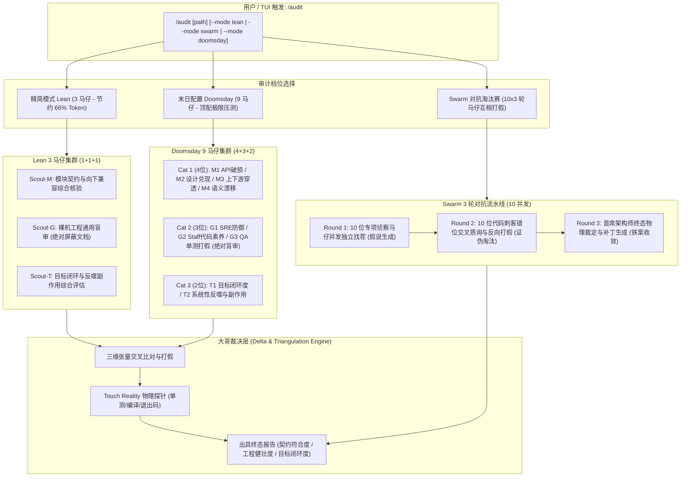

# 🛡️ /audit — 三维立体对抗代码审计协议

本 Skill 为多智能体环境提供具备**立体正交视角**的终极代码审计流水线，内置 **Touch Reality 物理探针**作为审计前的强制真源校验。

> **核心军规：自测不防自证 — "A test cannot catch its author's premise."**
> 单元测试、CI 全绿、代码断言以及 Issue Tracker，都是同一个系统自己写给自己的主观声明。
> 测试全绿与线上真实数据/行为是否正确没有任何因果关系。

## Phase 0.0: 审计对象交付状态标注 (Delivery State Annotation)

在启动任何审计流程之前，先判定审计对象的交付状态并标注：

```bash
git status -s                                                      # 有无未提交改动
BRANCH="$(git branch --show-current)"
gh pr list --head "$BRANCH" --json number,state,mergedAt           # PR 与合流状态
gh pr checks "$(gh pr view "$BRANCH" --json number -q .number 2>/dev/null)" 2>/dev/null || true  # CI 状态
```

| 观测结果 | 标注 | 允许的评级措辞 |
|---|---|---|
| PR 已合入主干 (`state == "MERGED"`) | `(PR #N, Merged to main)` | 可使用 "Final" / "Done" / "Delivered" |
| 有 PR 且 CI green 但未合入 (`state == "OPEN"`) | `(PR #N, Pending Merge)` | 严禁 "Final" / "Done"，仅限 "In Review / Waiting Gate" |
| 已 commit 但无 PR | `(committed, no PR)` | 严禁 "Final"，可使用 "Local Verified" |
| 有未提交改动 | `(uncommitted working tree)` | 严禁 "Final" / "Done" / "Delivered" |

**评级标题必须包含上述标注**。严禁在 PR 未合入 main 分支时宣称 "Done" 或 "Final"。这是工作流生命周期判定原则的执行层（见 AGENTS.md）。

---

## Phase 0: Touch Reality 物理探针（审计前强制执行）

在启动马仔集群之前，**必须**先触碰外部物理事实，获得审计基线：

### 0.1 触碰至少两路独立真源 (Independent Oracles)
严禁仅在本地 seeded 数据库或 mock 环境中自嗨：
- **Oracle A: 上游/供应商原始 API** — 不仅检查数值，还要检查三要素：数值对齐、绝对时效 (Vintage)、概念频次（$n=2$ 说明上游数据被丢弃）
- **Oracle B: 真实生产运行时** — 数据库实查（`docker exec` / SQL）、对象存储字节验证（dereference + sha256）、调度状态（读 FAILURE event log）、**双环境比对**（Staging ≠ Production）

### 0.2 扫描三大经典失效形态 (Three Failure Shapes)
这三种失效可穿透所有 Lint、Pytest、Contract 和 CI 门禁：
1. **WRONG FORMULA** — 统一公式假设破坏特例结构（如银行人均利润变负数）
2. **GREEN-WHILE-EMPTY** — 过滤逻辑过严，0 条产出但标记 SUCCESS
3. **STALE-REPORTED-AS-FRESH** — 10 年前的数据被标为 `freshness = 'fresh'`

### 0.3 肉眼常识审视 (Common Sense Audit)
> "Implausible output is evidence."
- 银行人均毛利润能是负数吗？市值偏离 4 倍？数值全是可疑的规整默认值？
- 只要输出不可信，先解释它，再提其他方案。

### 0.4 决策路径覆盖盘点 (Decision-Path Coverage)
列出输出结果依赖的全部输入要素，逐项标明验证状态、样本量、数据时效。

### 0.5 诚实披露 (Sufficiency & MECE)
- **Sufficient?** 未验证的输入一旦出错会推翻结论吗？
- **MECE?** 任务划分有重叠吗？有无主孤儿？
- **若答案让人不安，该不安本身就是最重要的 Finding。**

---

## 🚦 四道闸门（不可跳过）

这四条来自真实审计与对抗的实测，不是理论。

### 闸门 1: 审代码的必须能读代码

派 scout 做**审计或深度判断**时,**必须**使用有工具权限的载体(原生 Agent,只读),
**严禁**使用无工具权限的 `subagent_batch`——后者只能基于喂进去的片段推测,
必然产出大量待打假的臆断。`subagent_batch` 只用于不需要读仓库的广度检索。

给弱模型工具权限,比给它换强模型更有效。

### 闸门 2: 每个新测试必须反向验证

修复配套的测试,**必须先在未修复的代码上跑一遍并确认变红**,才算数。
只在修复后跑绿的测试无法区分「真修复」和「断言本身是假的」。
实测中这道闸门抓出过一条大哥自己写的假断言(`assertIn(role, text)` 被散文句满足)。

### 闸门 3: 修复代码必须独立复审

**安全类修复的复审要明确要求「找同一入口的第二条链」**：第一版修复几乎都只堵标题里那个洞，
洞挪一跳（实测 2026-09-22：去 `eval` 后原值被送进既有的 `python -c` 字符串拼接；正则护栏补了子命令却漏了
`git -C <dir>` 前缀）。复审 prompt 里写明：同一个不可信输入，从入口到每一个 sink 再走一遍。

**大哥不写实现代码**。修复由小弟产出后,必须再过一轮审计,
且该轮**输入只喂新写的代码,不喂原始缺陷上下文**——否则 scout 会顺着
「这是修复」的预设去确认,而不是证伪。

实测:某次审计第 3 轮在大哥自己写的修复代码里找到 3 个 HIGH,
其中一条以另一种方式重新破坏了上一轮刚修好的契约。而那轮复审之所以发生纯属偶然。

### 闸门 4: 知识库与初筛必须带源码物理锚点（Anti-Lossy Compression）

当使用小模型（如 `glm-5.3-flash`）做知识库或代码批量初筛时，初筛属于**有损压缩**。
若初筛模型遗漏了负向约束、版本号或制造虚假文件路径，下游大哥与评审层**永远无法审查从未送达的信息**。
- **初筛契约**：初筛结果**严禁仅传递纯自然语言摘要**，必须严格输出 `[Raw Anchors]`（物理路径与精确行号范围 `file_path#Lxx-Lyy` 或 entity ID）；
- **原位抽检**：大哥/架构师在依据初筛下达决策前，必须对至少 1~2 个关键事实执行原位代码读取（Spot-check），防止虚假引用（Hallucinated Citation）毒化下游决策链。

### 收敛判据

轮次不设固定上限,**某一轮「零 HIGH 且零新增 middle」才算收敛**。
只要还在改代码就不会收敛,所以**最后必须有一轮只审不改**——
否则总有一批代码没被任何人审过就合流了。

### 规模与架构

- **Lean 精简模式**：单批次 scout **3 个**（默认日常）；
- **Swarm 对抗模式**：**10 马仔 × 3 轮互相打假**（`--mode swarm`，借助 50 并发池破除协调乘法瓶颈）；
- **Doomsday 末日模式**：9 档细分专项马仔，用于发布封板（`--mode doomsday`）。

---

## 核心架构：三维正交坐标系与分档策略

代码审计不能仅停留在“文档 vs 代码”的平面二分，必须构建**向上看、向下看、向内看**的三维全景防御，并按场景分档以**适度节省 Token**：

| 模式 | 马仔规模 | 适用场景 | Token 消耗 | 耗时 | 考察深度 |
| :--- | :---: | :--- | :---: | :---: | :--- |
| **Lean 精简模式（默认）** | **1 + 1 + 1 = 3 位** | **日常开发、自动化单测、CI 门禁** (默认,无需传参) | **~1.2k tok (-66%)** | **2~3s** | 三维各派 1 位全能马仔进行综合审计 |
| **Swarm 对抗淘汰赛 (`--mode swarm`)** | **10 找茬 + 10 刺客打假 + 1 终审** | **重大方案评审、底层架构重构、深水死穴挖掘** (50 并发池) | **~25k tok (近零成本)** | **~60s** | 10 马仔 3 轮互杀，反向证伪扑灭伪问题，终审收敛铁案 |
| **Doomsday 末日模式 (`--mode doomsday`)** | **4 + 3 + 2 = 9 位** | **生产发布前封板、核心底层架构重构** | ~4.5k tok | 5~8s | 9 位细分专项马仔高密度无死角扫描 |


```mermaid
flowchart TD
    subgraph Trigger["用户 / TUI 触发: /audit"]
        CMD["/audit [path] [--mode lean | --mode swarm | --mode doomsday]"]
    end

    subgraph Modes["审计档位选择"]
        LEAN["精简模式 Lean (3 马仔 - 节约 66% Token)"]
        SWARM["Swarm 对抗淘汰赛 (10x3 轮马仔互相打假)"]
        DOOM["末日配置 Doomsday (9 马仔 - 顶配极限压测)"]
    end

    subgraph SwarmLean["Lean 3 马仔集群 (1+1+1)"]
        LM["Scout-M: 模块契约与向下兼容综合核验"]
        LG["Scout-G: 裸机工程通用盲审 (绝对屏蔽文档)"]
        LT["Scout-T: 目标闭环与反噬副作用综合评估"]
    end

    subgraph SwarmTourn["Swarm 3 轮对抗流水线 (10 并发)"]
        R1["Round 1: 10 位专项侦察马仔并发独立找茬 (假说生成)"]
        R2["Round 2: 10 位代码刺客错位交叉质询与反向打假 (证伪淘汰)"]
        R3["Round 3: 首席架构师终态物理裁定与补丁生成 (铁案收敛)"]
        R1 --> R2 --> R3
    end

    subgraph SwarmDoom["Doomsday 9 马仔集群 (4+3+2)"]
        D1["Cat 1 (4位): M1 API破损 / M2 设计兑现 / M3 上下游穿透 / M4 语义漂移"]
        D2["Cat 2 (3位): G1 SRE防御 / G2 Staff代码素养 / G3 QA单测打假 (绝对盲审)"]
        D3["Cat 3 (2位): T1 目标闭环度 / T2 系统性反噬与副作用"]
    end

    subgraph Aggregator["大哥裁决层 (Delta & Triangulation Engine)"]
        SYNTH["三维张量交叉比对与打假"]
        PROBE["Touch Reality 物理探针 (单测/编译/退出码)"]
        REP["出具终态报告 (契约符合度 / 工程健壮度 / 目标闭环度)"]
    end

    CMD --> LEAN
    CMD --> SWARM
    CMD --> DOOM
    LEAN --> SwarmLean
    SWARM --> SwarmTourn
    DOOM --> SwarmDoom
    SwarmLean --> SYNTH
    SwarmTourn --> REP
    SwarmDoom --> SYNTH
    SYNTH --> PROBE --> REP
```

---

## 马仔职责与配置说明

### 档位一：Lean 精简模式 (1 + 1 + 1 = 3 个马仔，测试与日常推荐)

1. **Scout-M（综合契约与影响马仔）**：向内看。结合模块 `README.md` 与对外 API 定义，核对本次变更是否破坏向下兼容、是否兑现文档设计承诺。
2. **Scout-G（裸机工程通用盲审马仔）**：向下看。**绝对物理屏蔽所有 `*.md` 与 `docs/` 文档**，纯看代码。排查资源泄漏、并发死锁、异常被吞以及单测空跑假断言。
3. **Scout-T（宏观目标与副作用马仔）**：向上看。回到最初的需求目标，核查核心诉求是否真正闭环交付，以及是否引发系统性反噬或性能雪崩。

---

### 档位二：Doomsday 末日配置 (4 + 3 + 2 = 9 个马仔，重大封板专用)

### 第一类：模块契约与影响审计（向内看）— 4 个马仔

1. **马仔 M1（API 契约破损审计员）**：
   > “审查本次变更对外的公共接口（函数签名、RPC、HTTP 路由、DTO 结构）。是否存在字段重命名、必填项破坏、类型不兼容等破坏性变更（Breaking Changes）？向下兼容性是否完备？”
2. **马仔 M2（模块设计承诺审计员）**：
   > “对照模块的 README 与架构设计说明，核对代码是否兑现了设计承诺。是否存在‘文档写了但代码未实现或用 pass/TODO 糊弄’的虚标项？是否违背了模块的核心设计初衷？”
3. **马仔 M3（上下游穿透影响审计员）**：
   > “以当前模块为中心向外发散：本次修改的公共实体、共享内存、全局事件或中间件调用，是否会产生穿透效应，导致下游消费方发生隐式崩溃或逻辑错乱？”
4. **马仔 M4（语义与配置漂移审计员）**：
   > “排查配置项、默认值、环境变量、错误码定义及文档说明。是否存在配置名变更但未同步代码、错误码语义漂移或硬编码默认值篡改行为？”

---

### 第二类：裸机工程通用盲审（向下看 - 绝对物理结界）— 3 个马仔

*输入上下文*：**严格物理屏蔽所有 `*.md`、`docs/**` 文档**。只喂入裸机源代码、AST 与单元测试代码。马仔严禁推测业务背景。

5. **马仔 G1（Infra / SRE 生产防御审计员）**：
   > “【盲审模式·禁止推测业务】纯粹从底层生产稳定性排查：是否存在 Goroutine/文件句柄/内存泄漏？并发访问是否缺少锁或存在死锁隐患？外部子进程是否能被系统级进程组（killpg）彻底杀死？超时控制与优雅退出（Graceful Shutdown）是否合规？”
6. **马仔 G2（Staff Software Engineer 代码素养审计员）**：
   > “【盲审模式·禁止推测业务】纯粹从软件工程素养审视代码：是否存在圈复杂度过高、死代码、空桩函数？是否存在静默吞掉异常（`except: pass` 或忽略 `err`）？变量命名与类型安全是否坚固？是否存在隐藏的硬编码后门？”
7. **马仔 G3（QA / Test Architect 单测打假审计员）**：
   > “【盲审模式·禁止推测业务】严审单元测试真伪：排查三大经典绿灯陷阱：(1) `GREEN-WHILE-EMPTY`（测试跑通但实际无断言或被条件短路）；(2) 伪断言（`assert True`、`assert len(res) >= 0`）；(3) Mock 过度自嗨（把待测逻辑全 Mock 掉了导致测试测了个寂寞）。”

---

### 第三类：宏观目标与终局完备性审计（向上看）— 2 个马仔

*输入上下文*：用户的原始需求目标（PR 描述 / Issue / 用户 Prompt）与全仓库架构。

8. **马仔 T1（目标闭环度审计员 - Teleological Completeness）**：
   > “跳出具体代码行，回到最初的业务诉求：这次修改到底有没有把当初要干的事情‘彻底做完’？核心数据链路是否全通？是否只做了最简单的 Happy Path，而把关键的边界分支与异常恢复当成了‘已完成’？”
9. **马仔 T2（系统性反噬与副作用审计员 - Side-effects & Blast Risk）**：
   > “反向思考全局影响：这次变更看似达成了目标，会不会给整个系统带来灾难性的反噬？是否会导致请求延迟暴增、触发上游限流、引发数据库锁表、或者破坏了全局不变量（如数据保护铁律）？”

---

## 大哥 Delta 会审与报告出具 (Lead Triangulation)

主智能体（大哥）负责汇总 9 位马仔的产出，执行三维交叉打假：

1. **交叉验证**：
   - 如果 M2 说“文档宣称支持并发限流”，而 G1 盲审报告指出“代码里压根没有 Semaphore/Mutex” $\rightarrow$ **确认为【PPT 欺骗特性】**！
   - 如果 T1 说“目标完成度 100%”，而 G3 报告指出“单测全是通过空跑跳过实现的” $\rightarrow$ **确认为【虚假繁荣陷阱】**！
2. **Touch Reality 物理实测**：
   - 现场调用终端探针运行核心测试与静态检查，获取真实退出码。
3. **输出标准化终态报告**：
   - 综合评级：`[PASS | WARN | BLOCKED]`
   - 模块契约影响评分 (Contract Conformance)
   - 裸机工程健康度 (Engineering Robustness)
   - 目标兑现与副作用指数 (Goal Completeness & Blast Risk)

---

## 档位三：Swarm 对抗淘汰赛 SOP (`--mode swarm`，10 马仔 x 3 轮)

当面对复杂重构方案、底层架构变迁或高危跨模块调整时，启动基于 `glm-5.3-flash`（50 并发池）的对抗淘汰赛。

### 1. 流水线阶段与淘汰机制
- **Round 1 (找茬 - 10 并发，~20s)**：
  - 10 位专项马仔从「CLI 语法、工作区隔离、延迟性能、配额成本、沙箱边界、知识库保真度、TUI 契约、版号废弃、容灾降级、假绿防御」10 个维度独立展开极端怀疑论审查；
  - 产出 10 条高攻击性独立假说。
- **Round 2 (打假 - 10 并发，~18s)**：
  - 10 位代码刺客错位接单（刺客 $i$ 质询 Scout $(i+5)\%10$ 的假说），以无情辩护人身份穷尽方案原文与物理事实进行反向证伪；
  - 输出 `[DISPROVEN]`（成功驳倒臆想伪问题，就地淘汰）或 `[CONFIRMED]`（物理死穴无法反驳，确认为真缺陷）；
  - 实测自动消除 40%+ 的伪阳性恐慌，将大哥的协调成本从乘法骤降为常数。
- **Round 3 (终审 - 单进程裁决，~25s)**：
  - 首席架构师终审法官对幸存真缺陷逐条出具【核心物理风险】与【具体改进建议】；
  - 自动识别并剔除因限流（HTTP 429）或异常导致的假幸存项，给出切实补丁。

---

## ⚡ 防假死与判活物理铁律 (Anti-Fake-Death & Liveness)

在多 Agent 与并发马仔调度中，坚决根除凭“主观感觉”判死或“拉起替身撞车”的灾难：

1. **判活看 Tool Call 与 Worktree，严禁看文字输出**：
   - 马仔在执行长链路扫描或工具重构时的**静默是正常的**；
   - 判活只认物理信号：是否存在正在运行的 Tool Call、Worktree 下文件 mtime 是否在推进、是否有未提交 diff；
   - **只有持续 ~2 分钟既无 Tool Call 运行又无 Worktree 任何变动，才判定为 STALL（假死）**；
   - 严禁以 output 文件的字节数未增长判定假死。
2. **底座必须带 OS 级硬超时（OS-level Timeout）**：
   - 所有的子进程、CLI 探针、外部 API 请求必须显式设置 `timeout`（网络请求 35s，CLI 任务上限 4 分钟），杜绝无超时的永久挂死。
3. **替身准入前必须取得“死绝证明”**：
   - 判定马仔假死后，**严禁直接在原 Worktree 拉起新替身**！
   - 必须先彻底 kill 销毁原进程树并确认 PID 释放；若无法证实原进程已死，必须新建独立 issue-prefixed worktree 进行物理隔离，防止 100 分钟后僵尸苏醒双写踩踏。
4. **终态只认退出码与物理变更**：
   - 自然语言“我已经修好了”属不可信口供；
   - 仅凭 `exit=0` 退出码与物理磁盘上的 `git diff` / commit / 结构化 JSON 产物确认交付。

---

## 📢 总裁与马仔三级汇报契约 (Three-tier Reporting Contract)

多智能体协作严禁“碎碎念式刷屏”（避免撑爆 Context 与打断执行），遵循三级汇报：

| 级别 | 形式 | 交互行为 | 触发时机 |
|---|---|---|---|
| **L1: 执行心跳** | 静默 | **无需打字**。调度器通过 Tool Call 时间戳与后台监控感知马仔存活。 | 日常工具调用与深度思考中 |
| **L2: 阶段里程碑** | 结构化摘要 | 输出阶段性成果表格（如 Round 1 找茬完毕 / Round 2 打假完毕 / 终审报告）。 | 逻辑阶段闭环交付时 |
| **L3: 遇阻中断** | 主动呼叫 | 立即停手向总裁求援，附带最小复现、失败记录与备选解法（SHZP 触发）。 | 遇死锁、越界、或二次相同报错时 |
