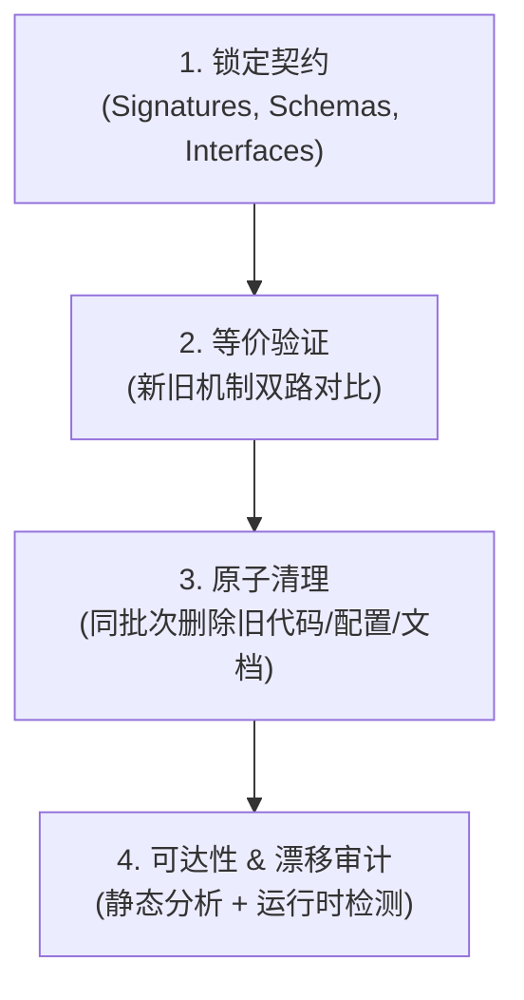

# SSOT — 单一真源收敛方法论

本 Skill 提供从"多处散落、各自为战"收敛到"单一真源 (Single Source of Truth)"的完整方法论与实战 SOP。

> **核心定理：SSOT 是目标，不是某一种技术。**
> DDD、契约先行、代码生成、投影机制……都是达成 SSOT 的手段。选择哪条路径取决于你要收敛的是什么（领域模型？配置？规则？Schema？）。

---

## 七条实现路径

### 1. DDD 领域建模 (Domain-Driven Design)
- **适用场景**：业务逻辑复杂、多团队协作、领域概念分散在代码各层
- **做法**：锁定 Domain Model 为真源 → Service / Repository / DTO 全部从领域模型派生
- **判定标准**：改一个业务概念，只需改一处定义

### 2. 契约先行 (Contract-First)
- **适用场景**：API 设计、微服务间通信、前后端分离
- **做法**：先写 OpenAPI / Protobuf / JSON Schema → 代码从契约生成
- **判定标准**：契约文件是唯一决定接口形态的地方，代码是它的投影

### 3. 投影机制 (Projection)
- **适用场景**：一份配置/规则需要分发到 N 个消费者（例如把一份 agent 规则投影到多个宿主各自的配置位置）
- **做法**：维护一份 SSOT 文件 → 构建工具自动投影到所有目标位置 → 漂移检测保障一致性
- **判定标准**：目标文件不应被直接编辑，只能通过投影工具更新

### 4. 代码生成 (Code Generation)
- **适用场景**：Schema → DTO/Validator/Migration/Mock/文档
- **做法**：Schema 或 DSL 是真源 → 构建管线自动生成派生代码 → 生成物标记 `DO NOT EDIT`
- **判定标准**：生成物可以随时删除重建，不包含手工逻辑

### 5. 原子清理 (Atomic Cleanup)
- **适用场景**：重构、迁移、替换核心组件
- **做法**：新机制上线且等价验证通过后，**同一批变更中彻底删除旧代码**
- **判定标准**：不存在 `@deprecated` "后续再删"的借口；新旧不并存

### 6. 可达性审计 (Reachability Audit)
- **适用场景**：定期代码卫生、发版前清理
- **做法**：从系统入口 (`main.py`, `defs.py`, service entrypoint) 计算静态可达性 → 识别死代码/孤儿
- **判定标准**：
  - 有写无读 = 废弃物
  - **有读无写 = 缺陷**（比旁边无人引用更危险）
  - 无人引用的孤儿模块 = 立即删除

### 7. 漂移检测 (Drift Detection)
- **适用场景**：SSOT 与运行时/部署态之间的一致性保障
- **做法**：用只读的比对命令（`terraform plan` 这类，或本环境自己的体检工具）检测偏移 → 告警或自动修复
- **判定标准**：SSOT 与真实运行时零漂移

---

## 四步收敛 SOP（通用流程）

### 1. 自顶向下锁定契约 (Top-Down Contract Locking)
严禁在没有明确顶层契约的情况下自底向上编写加工逻辑：
- **锁定函数签名与领域模型**：在编写任何底层转换前，先严格定义 Service / Domain 接口函数签名、参数类型与返回值。
- **锁定数据 Schema**：明确输入输出的 SSOT 数据结构。
- **锁定可观测端点**：优先确定外部使用者、Dashboard 或 API 端点看到的数据形态，倒推内部实现。

### 2. 新旧机制等价性证明 (Equivalence Proof)
在替换核心组件（如解析器、计算引擎、状态机）时：
- **编写双路对比测试**：使用真实输入，验证新实现与旧实现的产出具有 100% 行为等价性或符合预期的修正。
- **活体验证先行**：若改动涉及调度或告警栈，必须在 Staging 环境活体验证通过，不得仅凭单测过关。

### 3. 原子化彻底清理 (Atomic Legacy Eradication)
> **"清理不是以后的事，清理是当前变更闭环的组成部分。"**

当等价性验证通过后：
- **删除老旧实现代码**：移除旧类、旧函数、无用适配层与临时转换器。
- **删除死文件与配置**：移除旧的 YAML 声明、过期的 compose 卷或废弃的环境变量。
- **同步更新 SSOT 文档**：清理掉描述旧机制的历史文档与注释，将新逻辑写入对应 SSOT。

### 4. 静态可达性与漂移审计 (Reachability & Drift Audit)
- 从系统入口根节点计算静态可达性。
- **有写无读即废弃，有读无写更是缺陷**。
- 运行漂移检测工具，确认 SSOT 与运行时零偏移。

---

## 触发时机 (When to Use)

1. 用户说"重构"、"清理"、"收敛"、"真源"、"SSOT"；
2. 发现代码库中同一概念在多处定义且互相矛盾；
3. 新机制上线后旧代码仍然残留；
4. 体检或漂移检测报告投影与真源不一致。
